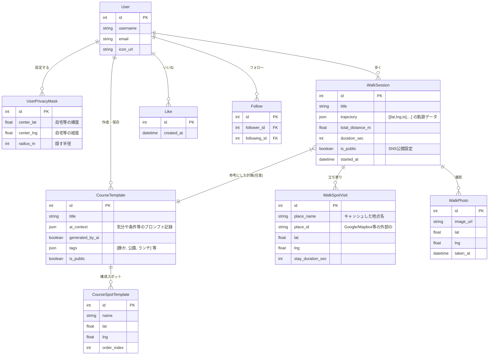

```mermaid
erDiagram
    %% --- ユーザー & 設定 ---
    User ||--o{ UserPrivacyMask : "設定する"
    User ||--o{ WalkSession : "歩く"
    User ||--o{ CourseTemplate : "作成・保存"
    User ||--o{ Like : "いいね"
    User ||--o{ Follow : "フォロー"

    %% --- 走行ログ (Actual Record) ---
    WalkSession ||--o{ WalkSpotVisit : "立ち寄り"
    WalkSession ||--o{ WalkPhoto : "撮影"
    WalkSession }|--|| CourseTemplate : "参考にした計画(任意)"

    %% --- 計画・AI提案 (Plan / Template) ---
    CourseTemplate ||--o{ CourseSpotTemplate : "構成スポット"

    User {
        int id PK
        string username
        string email
        string icon_url
    }

    UserPrivacyMask {
        int id PK
        float center_lat "自宅等の緯度"
        float center_lng "自宅等の経度"
        int radius_m "隠す半径"
    }

    WalkSession {
        int id PK
        string title
        json trajectory "[[lat,lng,ts],...] の軌跡データ"
        float total_distance_m
        int duration_sec
        boolean is_public "SNS公開設定"
        datetime started_at
    }

    WalkSpotVisit {
        int id PK
        string place_name "キャッシュした地点名"
        string place_id "Google/Mapbox等の外部ID"
        float lat
        float lng
        int stay_duration_sec
    }

    WalkPhoto {
        int id PK
        string image_url
        float lat
        float lng
        datetime taken_at
    }

    CourseTemplate {
        int id PK
        string title
        json ai_context "気分や条件等のプロンプト記録"
        boolean generated_by_ai
        json tags "[静か, 公園, ランチ] 等"
        boolean is_public
    }

    CourseSpotTemplate {
        int id PK
        string name
        float lat
        float lng
        int order_index
    }

    Like {
        int id PK
        datetime created_at
    }

    Follow {
        int id PK
        int follower_id FK
        int following_id FK
    }
```